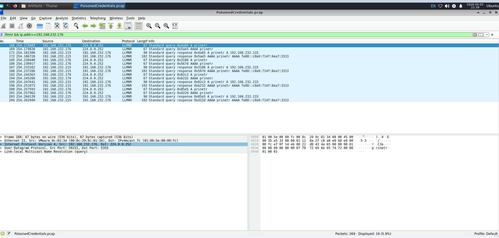
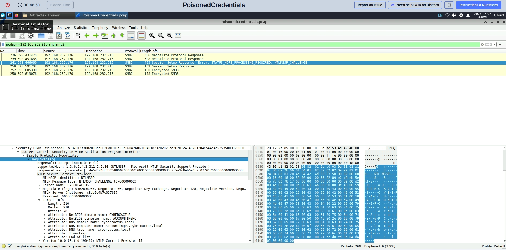

# PoisonedCredentials — CyberDefenders Lab

**Platform:** CyberDefenders  
**Tool:** Wireshark  
**File:** PoisonedCredentials.pcap  

---

## What This Lab Is About

This lab is about an LLMNR and NBT-NS poisoning attack. A rogue machine on the network was intercepting broadcast queries from other machines and sending back fake responses. Once a victim believed the rogue machine was the real server, it tried to authenticate and handed over its credentials. My job was to dig through the packet capture and figure out what happened.

---

## Q1 — What was the mistyped query?

The machine at 192.168.232.162 tried to connect to a file share but typed the name wrong. DNS couldn't find it so the machine broadcasted the request over LLMNR and NBT-NS instead. That's the opening the attacker needed.

I filtered for LLMNR traffic from that IP and found the query right away in the Info column and packet details.

```
llmnr && ip.addr==192.168.232.162
```

I also checked NBT-NS to confirm:

```
nbns && ip.src==192.168.232.162
```

The mistyped name was **fileshaare** — double 'a' instead of one.


---

## Q2 — What is the rogue machine's IP?

I filtered all LLMNR traffic and watched the Source column. Every single time a victim machine sent out a query, the same IP responded. That's not normal behavior. A real machine doesn't answer everyone's broadcasts like that.

```
llmnr
```

**Rogue machine: 192.168.232.215**


---

## Q3 — What is the second victim's IP?

I filtered LLMNR traffic for a second machine and saw the exact same poisoning pattern. The machine would ask, and .215 would immediately answer every single time.

```
llmnr && ip.addr==192.168.232.176
```

**Second victim: 192.168.232.176**



---

## Q4 — What username was compromised?

After the poisoning the victim machine thought it was connecting to a real server and automatically tried to log in. That login attempt sent the username over the network. I filtered for NTLMSSP authentication packets to find it.

```
ntlmssp.auth.username
```

Packet 242 had the answer. The format was domain\username so cybercactus.local is just the network name and janesmith is the actual account that got compromised.

**Compromised username: janesmith**

---

## Q5 — What hostname did the attacker access over SMB?

Once the attacker had the credentials they moved into the network over SMB. I filtered for SMB traffic going to the rogue machine and expanded the NTLMSSP section in the packet details. The hostname was sitting right there under the NetBIOS computer name attribute.

```
ip.dst==192.168.232.215 and smb2
```

**Hostname: ACCOUNTINGPC**



---

## What Happened Overall

A machine mistyped a file share name. DNS failed so it broadcasted over LLMNR and NBT-NS. The attacker at 192.168.232.215 intercepted that broadcast and responded with its own IP. The victim thought it found the right server and tried to authenticate, sending janesmith's credentials straight to the attacker. The attacker then used those credentials to get into ACCOUNTINGPC over SMB. A second machine at 192.168.232.176 got hit with the same attack.

---

## Filters Used

| What I Was Looking For | Filter |
|------|--------|
| LLMNR traffic from first victim | `llmnr && ip.addr==192.168.232.162` |
| All LLMNR traffic | `llmnr` |
| NBT-NS traffic from first victim | `nbns && ip.src==192.168.232.162` |
| Compromised username | `ntlmssp.auth.username` |
| SMB traffic to rogue machine | `ip.dst==192.168.232.215 and smb2` |
